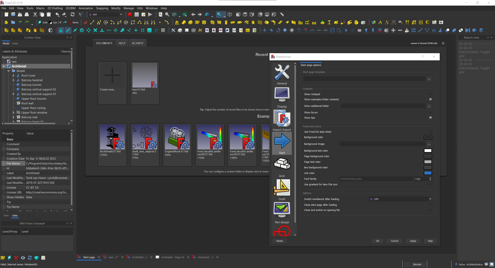
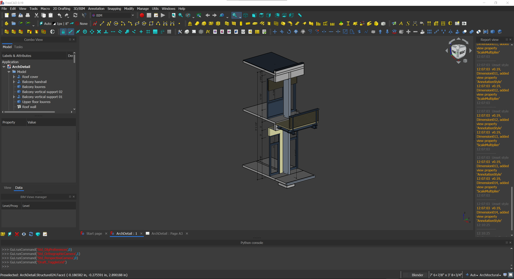
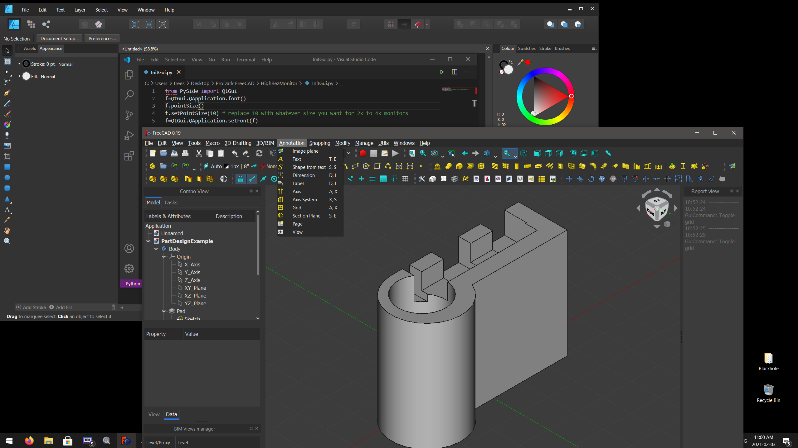
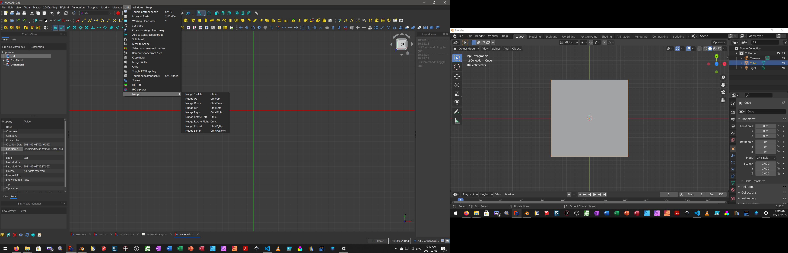

## ProDark-FreeCAD-theme
FreeCAD Dark theme  with 4k monitor small font fix (defaults to 10) but can be changed in InitGui.py with editor.

## Installation
# On Windows 10
Install ProDark.qss into FreeCAD Folder\data\Gui\Stylesheets\ and HighRezMonitor Folder with InitGui.py into C:\Users\UserName\AppData\Roaming\FreeCAD\Mod\

## Discussion
Feel free to discuss this addon on its [New ProDark Theme with 4k small text Mod](https://forum.freecadweb.org/viewtopic.php?f=34&t=55134&start=0)

Right Click/View Image too see in 2K

## License
GPL v3.0 (see [LICENSE](LICENSE))
